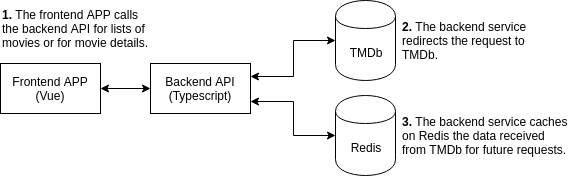

# CineWeb

## Project setup
```
npm install
```

### Compiles and hot-reloads for development
```
npm run serve
```

### Compiles and minifies for production
```
npm run build -- --mode production
```

### Architecture
The architecture for CineWeb is very simple. It contains four elements:
1. A Frontend APP written in VueJS
1. A Backend API written in TypeScript and using the NestJS Framework
1. A cache layer using Redis
1. TMDb as the project database



### Assumptions
1. The project description asks for a search for movies feature. Since it doesn't say the search should be only on upcoming movies, I used the search on all movies API available from TMDb.

### Frontend Libraries
* **vue:** Main frontend framework.
* **vue-router:** Makes it easier to handle routes on Vue APPs
* **rxjs:** Used for reactive programing using Observables to make it easier to handle async events and callback. (e.g. It's used in API requests in the APP)
* Other libraries contain code for browser polyfills, typescript transpiling and code packing for browsers.

### Backend Libraries
* **nestjs:** A Progressive NodeJS framework. It contains modules for functionalities such as dependency injection, router setup using decorators syntax and auto generating API documentation.
* **axios:** HTTP client. Used to make it easier to call TMDb API.
* **class-transformer and class-validator:** Both are used internally by NestJS for validating client API request.
* **ioredis:** Used for accessing Redis DB interface from the Node APP.
* **lodash:** General purpose library. It provides some useful methods.
* **moment:** Provides date handling utilities. It's only used for providing a human readable release date for movies.
* **winston:** Provides useful logging utilities. It's used for logging server side errors.
* Other libraries are used internally by other libraries or for transpiling Typescript code into JavaScript.
